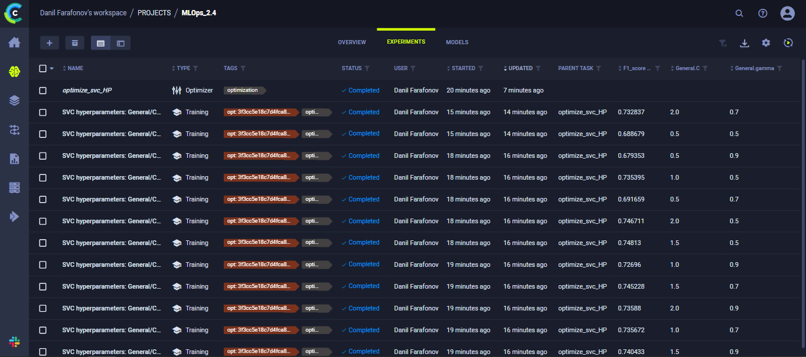
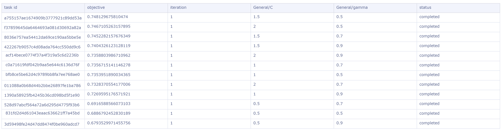
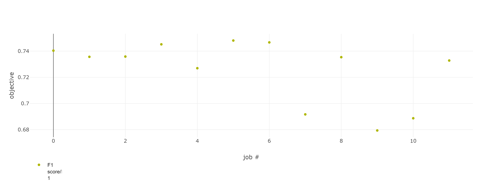

# MLops_2-final_task
Практическое задание №4 по дисциплине "Автоматизация машинного обучения"(MLops). 
В качестве инструмента выполненения задачи выбран **ClearML**

## Реализация
* Поставленная задача - достижение лучшей метрики F1_score в Kaggle соревновании [Natural Language Processing with Disaster Tweets](https://www.kaggle.com/competitions/nlp-getting-started/overview) путем подбора гиперпараметров модели
* Модель - [Метод опорных векторов (SVC)](https://scikit-learn.org/stable/modules/generated/sklearn.svm.SVC.html) реализации scikit-learn
* Для трекинга ML-экспериментов использован [ClearML](https://app.clear.ml/settings/workspace-configuration)
* Основной скрипт `main.py` содержит код предобработки данных и обучения модели с гиперпараметрами, описанными в коде под переменной `parameters` 
* Для подбора гиперпараметров модели `С` (характеризует поверхность принятия решений) и `gamma` (определяет влияние обучающего примера) использовался **HyperParameterOptimizer** в скрипте `optimize.py`. Правильный выбор этих параметров имеет решающее значение для производительности SVC
 
## Состав команды
* Семерикова Ксения (РИМ-220907)
* Фарафонов Данил (РИМ-220907)

## Ход работы
В скрипте `optimize.py` были указаны требования к значениям перебираемых гиперпараметров, изначально установленных на основании опыта выполнения подобных задач классификации. Благодаря **HyperParameterOptimizer** было выполнено несколько экспериментов, по итогу выполнения которых регистрировалась полученная метрика F1_score. Таким образом, лучшим кандидатом оказалась модель с параметрами: `С`=1,5 и `gamma`=0,5. Ниже представлены скриншоты с перечнем созданных задач для проведения экспериментов и зарегистрированные результаты в виде таблицы и графика. 

Созданные задачи в **ClearML**

Эксперименты, выполненные с помощью **HyperParameterOptimizer**

График результатов выполнения экспериментов

